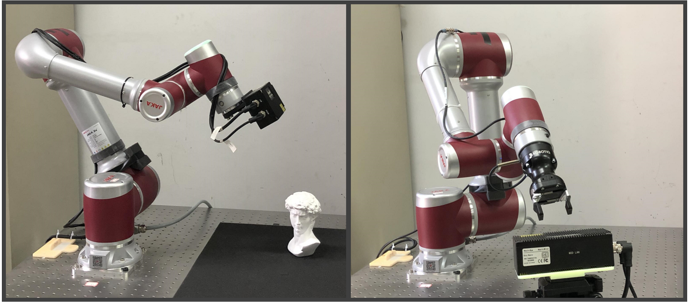
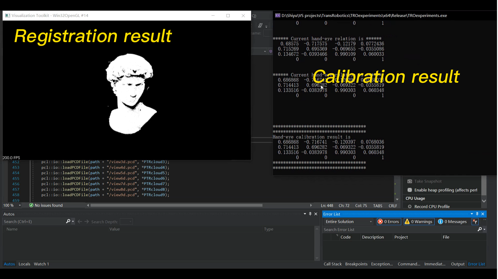
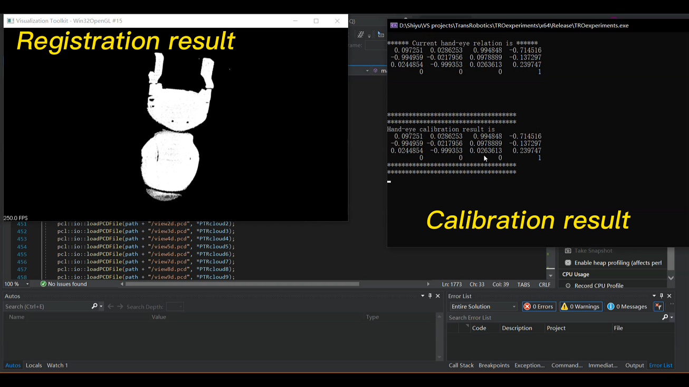

# RegHEC
## About
RegHEC is a registration-based hand-eye calibration technique using multi-view point clouds of arbitrary object. It tries to align multi-view point clouds of arbitrary object by estimating the hand-eye relation, thus both point clouds registration and hand-eye calibration are achieved simultaneously, making it favorable for robotic 3-D reconstruction task, where calibration and registration processes are normally conducted separately. 

<!--The idea is simple. Multi-view point clouds point clouds captured at different viewpoints should align, after transformation into robot base frame by left multiplying first correct hand-eye(flange-sensor) relation then corresponding robot poses(pose of flange frame w.r.t robot base, when point clouds are captured).-->

<!--RegHEC tries to align multi-view point clouds of arbitrary object by estimating the hand-eye relation, thus both point clouds registration and hand-eye calibration are achieved simultaneously, making it favourable for robotic 3-D reconstruction task, where calibration and registration processess are normally separated. -->

The cores of RegHEC are 2 novel algorithms. First, Bayesian Optimization based initial alignment(BO-IA) models the registration problem as a Gaussian Process over hand-eye relation and covariance function is modified (given in `ExpSE3.cpp`) to be compatible with distance metric in 3-D motion space SE(3). It gives the coarse point clouds registration then hand over the the proper initial guess of hand-eye relation to an ICP variant with Anderson Accleration(AA-ICPv) for later fine registration and accurate calibration. 

<!--First, point clouds initial alignment and rough hand-eye relation are obtained via Bayesian Optimization,
where registration problem is modeled as a Gaussian Process over hand-eye relation and covariance function is modified to be compatible with distance metric in 3-D motion space SE(3). Second, an ICP variant, regarded as a fixed-point problem and significantly accelerated by Anderson Acceleration, is proposed to realize fine registration and accurate hand-eye calibration. -->

As a general solution, RegHEC is applicable for most 3-D vision guided task in both eye-in-hand and eye-to-hand scenario with no need for specialized calibration rig(e.g. calibration board) but arbitrary available object. *This technique is verified feasible and effective with real robotic hand-eye system and varieties of arbitrary objects including cylinder, cone, sphere and simple plane, which can be quite challenging for correct point cloud registration and sensor motion estimation using existing method.*    

<!--For more information, please refer to our paper.-->

## Building
I work on Windows operation system with VS2019. This repository is a C++ solution developed with the following versions of external libraries:

**Limbo 2.1**    
[Limbo](https://github.com/resibots/limbo) is an open source C++ library for Bayesian optimization, which relies on [NLOpt](https://github.com/stevengj/nlopt) for maximization of acquisition function. Both limbo 2.1 and precompiled NLopt 2.5.0 with MSVC 2019 are given above for your convenience. Please note that, limbo is currently mostly developed for GNU/Linux, thus we modified the system call in the sys.hpp(in limbo-release-2.1/src/limbo/tools) to make it compatible with Windows. 
Besides, the `ExpSE3.cpp` is already copied to limbo-release-2.1/src/limbo/kernel, so basically limbo-release-2.1 got all you need to build under windows.
  
**Sophus 1.0.0**   
[Sophus](https://github.com/strasdat/Sophus) is a c++ implementation of Lie groups commonly used for 2d and 3d geometric problems (i.e. for Computer Vision or Robotics applications). Sophus 1.0.0 is given above for your convenience. 

**PCL 1.11.1**   
[PCL](https://github.com/PointCloudLibrary/pcl) is very commonly used c++ library for point cloud processing. We suggest installing [PCL-1.11.1-AllInOne-msvc2019-win64.exe](https://github.com/PointCloudLibrary/pcl/releases/tag/pcl-1.11.1) with 3rd party libraries checked. As both Eigen and Boost are included, which are also dependencies of limbo. There are abundant instructions to get PCL ready, we do not detail here.

Clone or download this repo, open VS2019, then create a new console application. In solution explorer, add `RegHEC.cpp`, `GNsolver.cpp` and `GNsolver.h` as existing items. In properties, set `%your path%\sophus-1.0.0\include`, `%your path%\limbo-release-2.1\src` and `%your path%\nlopt-2.5.0\include` as include directories. Set `%your path%\nlopt-2.5.0\lib` as library directories and `nlopt.lib` as additional dependencies. Do not forget to configure the PCL-related settings and copy the `nlopt.dll` to where the executable is then you are ready to run.

You are welcome to convert it to Linux, but I have not. Note that you need to switch system api in sys.hpp of limbo, use building tool and dependencies compatible with Linux if you do so. 

## Input
Multi-view point clouds in `.pcd` and corresponding robot poses in `RobotPoses.dat`(pose of flange frame w.r.t robot base frame) where point clouds are captured. 

Data used in the paper is given in Data folder. In our experiments, point clouds were captured from 9 different viewpoints. Change the input directory `
std::string path = "./data/David";` to try different object. You can also try with your own data.  
  
`RobotPoses.dat` gives the robot poses in 6 dimensions. First 3 elements in each row are Euler angles for orientation and second 3 elements are positions. 
The current version is rather static, some simple modifications are needed to test with number of viewpoints other than 9. We will make the solution more dynamic in the later commit.

## Output
Calibrated hand-eye relation and multi-view point clouds registration.

Registration of 9 David point clouds and calibration results given by RegHEC(eye in hand)

Registration of 9 Gripper point clouds and calibration results given by RegHEC(eye to hand)

